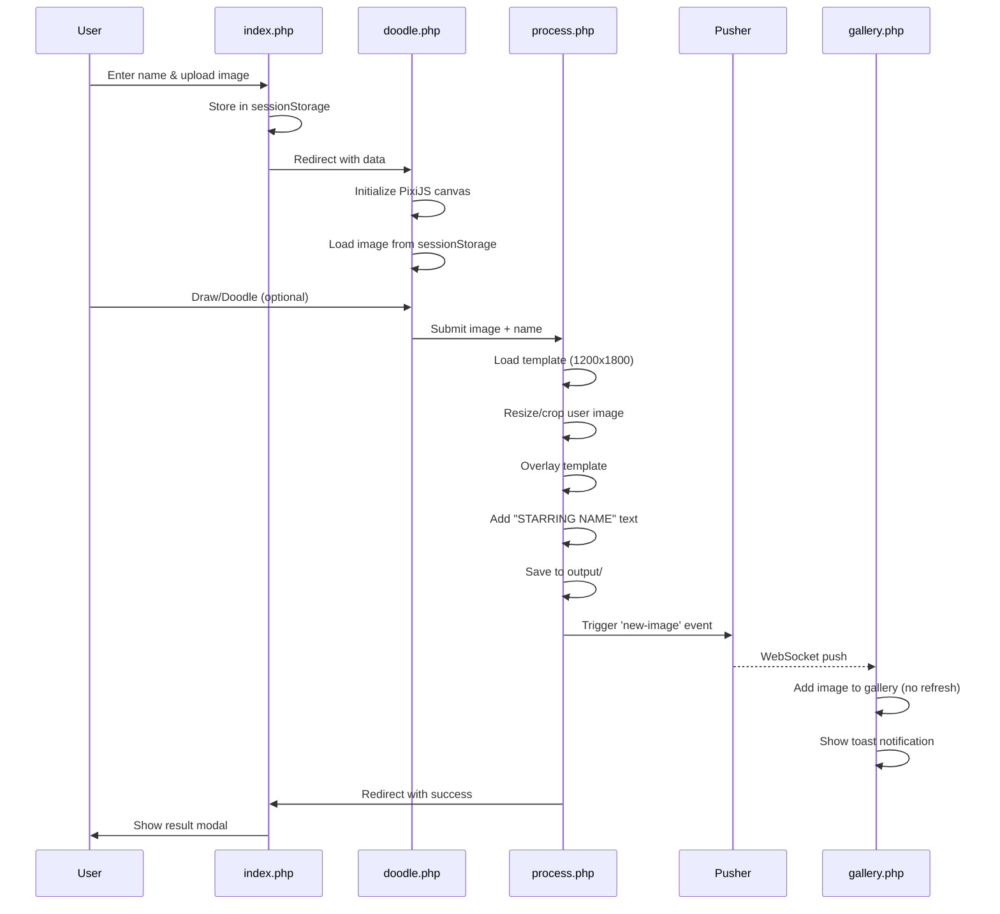
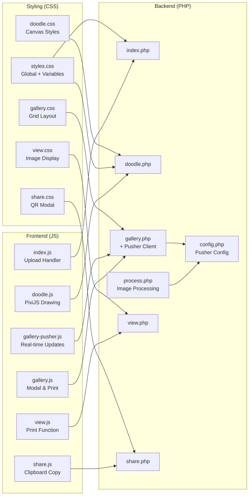

# Spotlight - Interactive Image Template Overlay Application

A real-time photo booth application that allows users to upload photos, draw/doodle on them, and generate branded spotlight images with custom templates and text overlays.

## Features

### 🎨 Core Functionality
- **Image Upload & Processing** - Upload photos with automatic resizing and cropping to match template dimensions
- **Interactive Doodle Canvas** - Draw on uploaded images using PixiJS with multiple colors and brush tools
- **Template Overlay** - Automatic overlay of transparent PNG template on user photos
- **Custom Text** - Dynamic "STARRING [Name]" text generation with custom fonts
- **Real-time Gallery** - Live gallery updates using Pusher WebSockets
- **QR Code Sharing** - Generate QR codes for easy image sharing
- **Print Functionality** - One-click printing with optimized layout

### 🎨 Theme System
- **Multiple Color Themes** - Pre-built themes (Fiery Red, Ocean Blue, Purple Haze, etc.)
- **CSS Variables** - Easy theme customization through centralized variables
- **Responsive Design** - Mobile-first design that works on all devices

## Technical Stack

### Backend
- **PHP 7.4+** - Server-side processing
- **GD Library** - Image manipulation and composition
- **Composer** - Dependency management
- **Pusher PHP SDK** - Real-time notifications

### Frontend
- **PixiJS v8.13.2** - Hardware-accelerated 2D canvas for drawing
- **Pusher JS Client** - Real-time updates
- **Vanilla JavaScript** - No framework dependencies
- **CSS3** - Modern styling with gradients and animations

### Libraries & APIs
- **QR Code API** - QR code generation for sharing
- **Web Audio API** - Notification sounds

## Installation

### Prerequisites
```bash
- PHP 7.4 or higher
- GD Library enabled
- Composer
- Web server (Apache/Nginx)
```

### Setup Steps

1. **Clone the repository**
```bash
cd /path/to/webserver/htdocs
git clone [repository-url] spotlight
cd spotlight
```

2. **Install dependencies**
```bash
composer install
```

3. **Configure Pusher (Optional)**
   - Sign up at [pusher.com](https://pusher.com)
   - Copy your credentials
   - Edit `config.php`:
```php
$pusherConfig = [
    'app_id' => 'your_app_id',
    'key' => 'your_key',
    'secret' => 'your_secret',
    'cluster' => 'your_cluster'
];
```

4. **Set up directories**
```bash
mkdir -p output samples
chmod 777 output samples
```

5. **Add your template**
   - Place your PNG template in `template/template.png`
   - Recommended size: **1200x1800 pixels** (2:3 aspect ratio)
   - Must have transparent areas for overlay

6. **Add custom font (Optional)**
   - Place your font file in `font/` directory
   - Update `$fontPath` in `process.php` if needed

## File Structure

```
spotlight/
├── css/
│   ├── styles.css          # Main centralized styles with CSS variables
│   ├── doodle.css          # Doodle page specific styles
│   ├── gallery.css         # Gallery grid and card styles
│   ├── view.css            # Image view page styles
│   └── share.css           # QR share page styles
├── js/
│   ├── index.js            # Upload form handling
│   ├── doodle.js           # PixiJS drawing application (270+ lines)
│   ├── gallery.js          # QR modal and print functions
│   ├── gallery-pusher.js   # Real-time update helpers
│   ├── view.js             # Print functionality
│   └── share.js            # Clipboard operations
├── font/                   # Custom fonts
├── template/
│   └── template.png        # Main overlay template (1200x1800)
├── output/                 # Generated images (auto-created)
├── samples/                # Sample gallery images
├── vendor/                 # Composer dependencies
├── config.php              # Pusher configuration
├── index.php               # Upload page
├── doodle.php              # Drawing canvas page
├── process.php             # Image processing logic
├── gallery.php             # Image gallery with real-time updates
├── view.php                # Single image view
├── share.php               # QR code sharing
└── composer.json           # Dependencies
```

## System Architecture

```mermaid
graph TB
    subgraph "Client Browser"
        A[index.php<br/>Upload Page] --> B[doodle.php<br/>Drawing Canvas]
        B --> C{User Action}
        C -->|Draw & Save| D[PixiJS Canvas]
        C -->|Skip Drawing| E[Direct Upload]
    end
    
    subgraph "Server Processing"
        D --> F[process.php]
        E --> F
        F --> G[Load Template<br/>1200x1800]
        G --> H[Resize/Crop<br/>User Image]
        H --> I[Overlay Template]
        I --> J[Add Text<br/>STARRING NAME]
        J --> K[Save to output/]
    end
    
    subgraph "Real-time System"
        K --> L[Pusher Notification]
        L --> M[gallery.php<br/>Live Update]
    end
    
    subgraph "Sharing & Output"
        M --> N[view.php<br/>Single Image]
        M --> O[share.php<br/>QR Code]
        N --> P[Print]
        O --> Q[Share URL]
    end
    
    style A fill:#eb3349
    style B fill:#f45c43
    style F fill:#2e1619
    style M fill:#1a0a0e
```



## Data Flow Diagram



## Image Processing Flow

```mermaid
flowchart LR
    A[Upload Image] --> B{Check<br/>Aspect Ratio}
    B -->|Wider than 2:3| C[Fit to Height<br/>Crop Sides]
    B -->|Taller than 2:3| D[Fit to Width<br/>Crop Top/Bottom]
    B -->|Exact 2:3| E[No Crop Needed]
    
    C --> F[Center Crop]
    D --> F
    E --> F
    
    F --> G[Result: 1200x1800]
    G --> H[Overlay Template]
    H --> I[Add Text Layer]
    I --> J[Final Image]
    
    style A fill:#eb3349
    style J fill:#2e1619
```



## Component Architecture



## Usage Flow

### 1. Upload Image
- User enters their name
- Uploads a photo (JPEG, PNG, or GIF)
- Image is stored in sessionStorage
- Redirects to doodle page

### 2. Doodle (Optional)
- PixiJS canvas loads the uploaded image
- User can draw with 4 color options (White, Red, Green, Blue)
- Clear button to remove all drawings
- Save button to process the image

### 3. Image Processing
**Process.php workflow:**
1. Load template to get target dimensions (1200x1800)
2. Load uploaded image
3. Calculate aspect ratio and resize/crop to match template
4. Overlay template PNG on user image
5. Add "STARRING [NAME]" text at bottom
6. Save to output directory
7. Trigger Pusher notification for real-time gallery update
8. Display result to user

### 4. Gallery
- Displays all processed images in a responsive grid
- Real-time updates when new images are created
- QR code generation for sharing
- Print functionality
- Pagination (9 images per page)

## Image Processing Logic

### Aspect Ratio Handling
All images are resized to match the template dimensions while preserving quality:

```php
Template: 1200x1800 (2:3 aspect ratio)

If uploaded image is wider:
  - Fit to height
  - Crop sides (center crop)

If uploaded image is taller:
  - Fit to width  
  - Crop top/bottom (center crop)
```

### Text Overlay
- Font: Linotype DidotLTPro Headline
- "STARRING" text: 30.72pt
- Customer name: 46.08pt (uppercase)
- Position: Centered, 8% from bottom
- Colors: White text with black shadow

## Print Specifications

### Default Settings
- **Output Size**: 1200x1800 pixels
- **Aspect Ratio**: 2:3 (standard photo print ratio)
- **Print Size**: Adapts to printer settings
- **Recommended Paper**: 4x6" photo paper, A4, or Letter
- **Margins**: None (full bleed)

### Print Behavior
- `max-width: 100%` - Scales to paper width
- `height: auto` - Maintains aspect ratio
- No forced margins in print mode

## Real-time Updates (Pusher)

### Configuration
Edit `config.php`:
```php
$pusherConfig = [
    'app_id' => 'your_app_id',
    'key' => 'your_key',
    'secret' => 'your_secret',
    'cluster' => 'mt1', // your cluster
    'use_tls' => true
];

$pusherChannel = 'spotlight-gallery';
$pusherEvent = 'new-image';
```

### Features
- Live gallery updates without page refresh
- Toast notifications for new images
- Sound effects for notifications
- Connection status indicators

## Customization

### Theme Colors
Edit `css/styles.css` root variables:
```css
:root {
    --primary-color: #eb3349;
    --secondary-color: #f45c43;
    --bg-dark-1: #1a0a0e;
    --bg-dark-2: #2e1619;
    /* ... more variables ... */
}
```

### Template
Replace `template/template.png` with your custom template:
- Must be PNG with transparency
- Recommended: 1200x1800 pixels
- Transparent areas will show user's photo
- Opaque areas will overlay on photo

### Drawing Colors
Edit `doodle.php` to add more color options:
```html
<div class="color-btn" style="background: #ff00ff;" 
     onclick="setColor('#ff00ff', event)" title="Magenta"></div>
```

### Font
Replace font file in `font/` directory and update `process.php`:
```php
$fontPath = __DIR__ . '/font/YourCustomFont.ttf';
```

## Troubleshooting

### Images not processing
- Check PHP GD library is installed: `php -m | grep gd`
- Verify write permissions on `output/` directory
- Check PHP error logs

### Pusher not working
- Verify credentials in `config.php`
- Check browser console for connection errors
- Enable debug mode in Pusher dashboard

### Drawing not working
- Check browser console for JavaScript errors
- Verify PixiJS CDN is accessible
- Clear browser cache

### Print issues
- Ensure browser allows popups
- Check printer paper size settings
- Try different browsers (Chrome recommended)

## Browser Support

- **Chrome/Edge**: Full support ✅
- **Firefox**: Full support ✅
- **Safari**: Full support (iOS 12+) ✅
- **Mobile Browsers**: Touch drawing supported ✅

## Performance Notes

- Images are processed server-side (no client-side resize)
- PixiJS uses WebGL hardware acceleration
- Pusher uses WebSockets for minimal overhead
- Gallery pagination limits DOM nodes
- Lazy loading for gallery images

## Security Considerations

- File upload validation by MIME type
- Output files have random names
- No direct file execution possible
- Pusher credentials should be kept secret
- Consider adding rate limiting for production

## Development

### Debugging
Enable PHP error logging:
```php
error_reporting(E_ALL);
ini_set('display_errors', 1);
```

### Testing Pusher
Check PHP error logs for Pusher debug output:
```bash
tail -f /var/log/apache2/error.log
```

## License

[Your License Here]

## Credits

- **PixiJS** - 2D rendering engine
- **Pusher** - Real-time communication
- **QR Server API** - QR code generation

## Support

For issues or questions, please open an issue on the repository.

---

**Version**: 2.0  
**Last Updated**: November 2025  
**Author**: [Your Name/Team]
